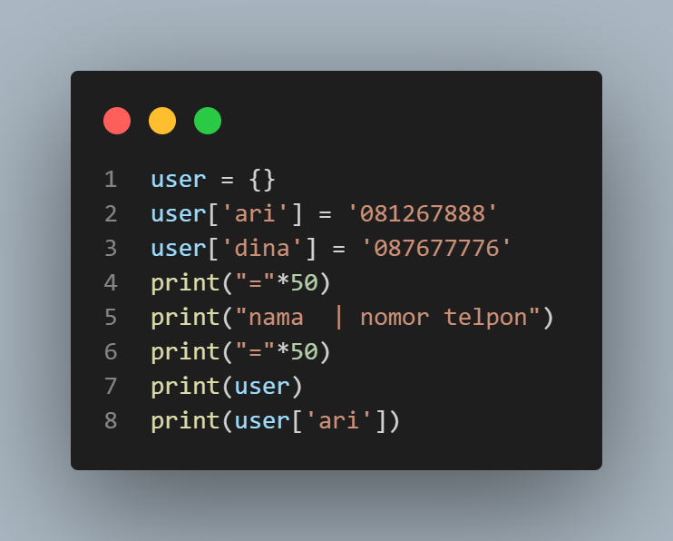

# praktikum 
## Latihan 1

## Buat Dictionary daftar kontak
### Nama sebagai key dan nomor sebagai value

### Tampilkan kontaknya ari

### - output

### Tambah kontak baru dengan nama Riko, nomor 087654544

### - output

### Ubah kontak dina dengan nomor 088999776

### - output

### Tampilkan semua nama 

### - output

### Tampilkan semua nomor

### - output

### Tampilkan daftra nama dan nomornya

### - output

### Hapus kontak dina

### - output

