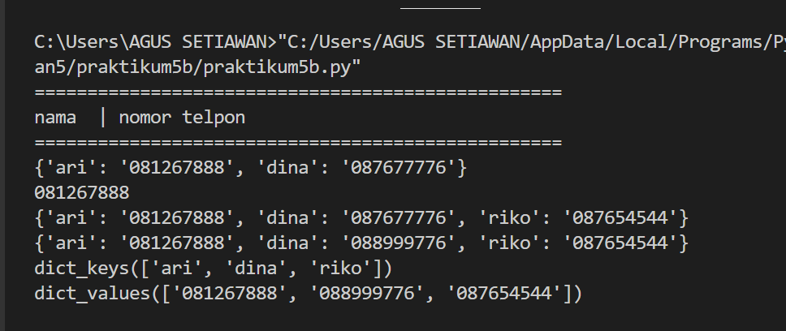
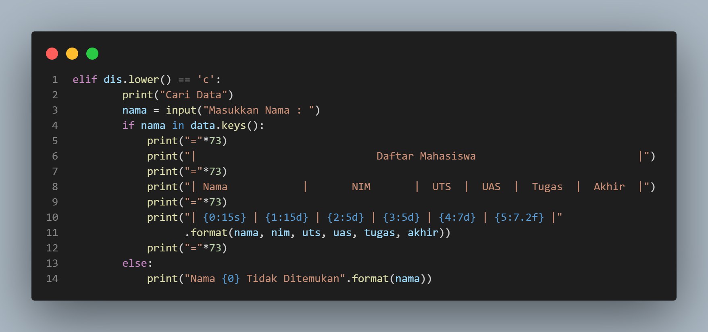

# praktikum 
## Latihan 1

## Buat Dictionary daftar kontak
### Nama sebagai key dan nomor sebagai value

### Tampilkan kontaknya ari

### - output

### Tambah kontak baru dengan nama Riko, nomor 087654544

### - output

### Ubah kontak dina dengan nomor 088999776

### - output

### Tampilkan semua nama 

### - output

### Tampilkan semua nomor

### - output

### Tampilkan daftra nama dan nomornya

### - output

### Hapus kontak dina

### - output

## TUGAS PRAKTIKUM

### Daftar Nilai Mahasiswa Menggunakan Dictionary
### # Pertama kita membuat dictionary kosong yang nantinya akan diinputkan data ketika program dijalankan.

### # Kemudian kita membuat kondisi perulangan dan sebuah keterangan untuk pilihan menu yang akan menjalankan program.

### - output

### # Membuat syntax untuk menambah data.

### - Disini apabila kita menginputkan 't' maka kita akan diminta untuk menginputkan beberapa data, dan yang kita inputkan akan masuk ke dictionar 'data' yang sudah di buat dengan data 'nama' sebagai keys dan sisa nya sebagai values.
### # Membuat syntax untuk membuat data.

### - output

1[gambar](Gambar/b.png)

### - apabila kita menginput 'u' maka akan ada keterangan masukan data nama yang akan di ubah, jika tidak ada nama yang sudah di input, akan ada keterangan "Nama {}
 tidak ditemukan ". dimana {} adalah nama/data yang mau kita ubah.
### # Membuat syntax menghapus data

### - output

### - apabila kita menginputkan 'h' maka kita diminta untuk menginputkan nama yang akan dihapus. jika nama ada didalam Dictionary , maka system  makan menghapus keys/nama tersebut berserta valuesnya pada statement del data[nama].
### # Membuat syntax untuk mencari data.

### - output

### - Apabila kita menginputkan 'c' maka kita akan diminta mamasukan nama yang akan dicari, dan apabila nama yang dicari ada didalam dictionary outputnya akan menampilkan data dari nama tersebut.
### # Membuat syntax untuk melihat/menampilkan data.

### - output

### - Apabila kita menginputkan 'l' maka sistem akan menampilkan data-data yang sudah di kita masukan. dan jika kita belum memasukan data maka outputnya akan menjadi "TIDAK ADA DATA".
### # Membuat syntax untuk menghentikan perulangan.

### - output

### - Apabila kita menginputkan 'k' maka program akan langsung berhenti.
### # Membuat syntax untuk apabila kita memilih pilihan yang tidak ada di menu.

### - output

### - jika kita menginputkan selain ada pada menu (t,u,h,c,l,k) maka kita diminta untuk memilih menu yang tersedia.

